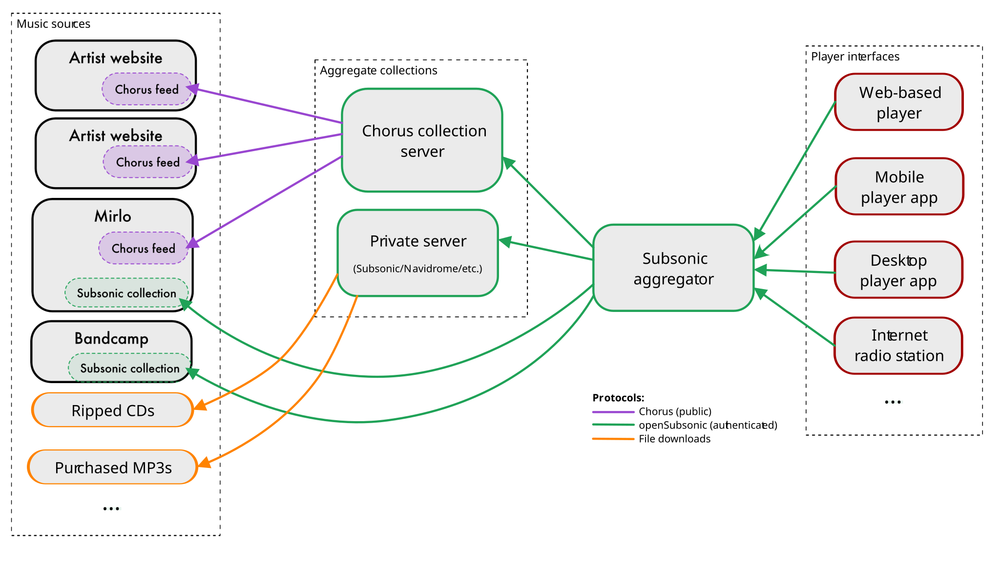

Title: The State of the Gorp
Author: fluffy
author-url: https://beesbuzz.biz/
Tag: planning
Tag: Join the Chorus
UUID: 7b546a06-e88a-4905-a0ab-2401492d7750
Entry-ID: 25
Date: 2026-09-24 14:56:04-07:00

Hello, it's been a hot minute. I thought it'd be helpful to talk about the current state of the project and what the current plans are for its future.

.....

### Current state

As of right now, there is only one known publisher of a [Chorus](/chorus) feed, namely [Sockpuppet](https://sockpuppet.band/). There are quite a few publishers who are sharing under the older Canimus spec, however, including [Mirlo](https://mirlo.space/) and [Song Fight!](https://songfight.org/).

[Fairplayer](https://fairplayer.band/) also consumes these older Canimus feeds, although it still is what I would consider to be a proof-of-concept stage.

Everyone involved in this is trying to take things slow and in a principled manner so that we don't get burned out. We're all excited for the future, but also trying not to be so impatient as to rush things.

### Faircamp plugin

With the amazing (and much-anticipated) release of [Faircamp 2.0.0](https://faircamp.org/changes/2.0.0/), the most obvious next step is to build Chorus feed support for it. Faircamp 2 has experimental support for plugins (which they currently call "programmatic access") which should eventually lead to a nice seamless integration, although in the short term it will probably be a bit fiddly to actually set up such a feed.

### Player ecosystem

The other main thing that needs to happen, of course, is having *players* that can consume these feeds, and this is where things get a bit more complicated. Here's a rough diagram showing how things fit together in the master plan:

#### Collection server

A collection server is analogous to a feed aggregator in the RSS/Atom world; it would collect various Chorus feeds and bring them into a larger collection.

This collection as a whole could then be browsed by people without an account, or people can create an account and select which parts of the collection appear in their own collections. People could also make and share curated collections from here.

This would also be a perfect spot for keeping track of who is listening to what for the purpose of collecting fair-trade [payments](/chorus/payments), as well as building a discovery and recommendation system.

Ideally these collection servers would be available as community-run instances, but single-user instances are also totally feasible.

Individual accounts would then be accessible via the [openSubsonic](https://opensubsonic.netlify.app/) protocol.

#### Subsonic aggregator

A Subsonic aggregator would allow users to merge multiple Subsonic accounts into a single source of music. This would allow a single point of access to multiple sources (such as a private Subsonic collection, a [Bandcamp account](https://blog.bandcamp.com/2026/07/16/discover-improvements-and-subsonic-implementation/#:~:text=Subsonic%20implementation%20%28beta), and, of course, a Chorus collection).

This would also allow setting priorities for different sources; for example, if the same album is available from multiple sources, the listener would probably want to hear it from their private server, *then* from their paid collection on a distribution service, then finally from Chorus.

This component would then present the aggregated music collection to listeners, most obviously via openSubsonic-supporting player apps.

This is the key part that makes the whole project work; by far the biggest reason people stick to Spotify and other streaming services is that it gives them the convenience of access. This piece of the puzzle makes it much easier for people to make decisions that benefit musicians and listeners alike.

#### Player frontend

A player frontend can then talk to the Subsonic aggregator. This could be a web-based UI, an [M3U playlist](https://en.wikipedia.org/wiki/M3U) adapter, a personal streaming radio station similar to [Icecast](https://icecast.org/) or [AzuraCast](https://azuracast.com/), or whatever else people come up with.

Ideally the Subsonic aggregator would provide at least a basic built-in web-based player UI.

### Current blockers

So, the path forward seems pretty clear, but there are the usual issues of resource constraints going around.

Everyone involved is quite passionate about this, but it's fundamentally a passion project, and passion can only bring people so far.

For my part, I have been dealing with long-term chronic health issues which limit the amount of time and energy I can put into things, and working on [my own music](https://sockpuppet.band/) has been my top priority. I also know that the Fairplayer and Mirlo folks are similarly motivated but also constrained by their own day jobs and living situations.

I think the things that would be the most impactful for making progress on this work would be:

1. Helping with funding! Here's some of the crowdfunding platforms you can use to help most effectively:

    * [fluffy](https://beesbuzz.biz/) can be supported via [Ko-Fi](https://ko-fi.com/fluffycritter), [Patreon](https://patreon.com/fluffy), or [Mirlo](https://mirlo.space/sockpuppet/support)
    * [Mirlo](https://mirlo.space/team) can be supported [on Mirlo](https://mirlo.space/team/support))
    * [Fairplayer](https://fairplayer.org/) can be supported [on OpenCollective](https://opencollective.com/fairplayer)

2. Providing development work! Do you have software skills? Great! Here's some relevant source repositories:

    * [Chorus specification](https://github.com/PlaidWeb/Chorus)
    * [Mirlo](https://github.com/funmusicplace/mirlo)
    * [Fairplayer](https://codeberg.org/fairplayer/fairplayer)

    No code has yet been written for the collection server or Subsonic aggregator components, but hopefully there will be a [plurality](https://indieweb.org/pluralism) of implementations to choose from.

3. Helping to organize!

    * Public discussions for Chorus happen [over on GitHub](https://github.com/PlaidWeb/Chorus/discussions)
    * Cross-project conversations take place mostly on the [funmusicplace Discord](https://discord.gg/VjKq26raKX) and [The Social Music Network](https://the.socialmusic.network/)

### Some philosophy

I personally follow the principle of people > protocols > implementations; protocols should exist to enable what benefits the people, and implementations should fulfill the protocols. Nothing about this project should become yet another monoculture with end-to-end lock-in. Let people pick and choose which parts work best for their needs.

Having direct interoperability between the components is a nice-to-have, and in particular being able to share a single account across the entire stack would be ideal. But I'd rather people be able to pick and choose which parts they want to use than to be locked in to a single implementation for all the things.

I'll refrain from going into the weeds about how this could be technologically accomplished, but I will say that [IndieAuth](https://indieweb.org/IndieAuth) provides a pretty good foundation for these concepts.

### In conclusion

Things are moving a lot slower than I'd personally like, but I definitely see a path forward. I hope others can share in this vision.
